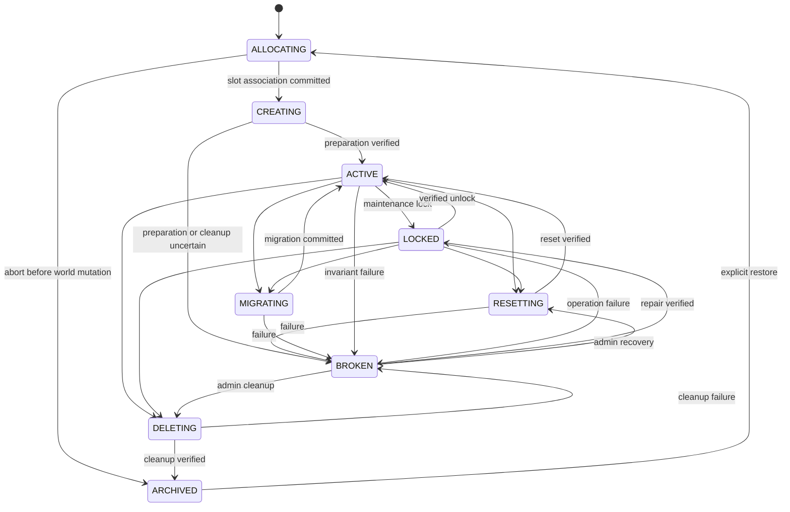

# Island Domain and Lifecycle

- Status: Accepted
- Specification version: 1

## Purpose

This specification defines the island aggregate, its mutation boundary, lifecycle transitions, team
membership, and recovery behavior. It intentionally does not define commands, GUI layout, SQL DDL,
or Paper event adapters.

## Aggregate boundary

`IslandId` is a UUID v4 independent from the owner, slot, and coordinates. An island aggregate owns:

- owner and member role assignments;
- current and maximum border state;
- spawn points and Magic Block definitions;
- progression state, counters, variables, and upgrades;
- lifecycle state, aggregate version, and pending critical operation references.

The loaded aggregate MAY be mutable for hot-path efficiency, but it MUST only be read or mutated by
its island lane. Rules, public API consumers, metrics, audit writers, and asynchronous persistence
workers MUST receive immutable snapshots or explicit deltas, never the mutable aggregate.

Every accepted mutation increments a non-negative 64-bit aggregate `version`. Repository updates
MUST include the expected previous version. An unexpected version conflict is an invariant failure:
the runtime MUST discard the loaded aggregate, stop gameplay for that island, and reconcile from
authoritative state rather than merging unknown changes.

## Sequential island lane

Every command that can mutate an island MUST enter a lane keyed by `IslandId`, including Magic Block
breaks, member changes, border upgrades, resets, migrations, repairs, and admin operations.

The lane is a transient serial queue, not a permanent thread or repeating task. It MUST:

1. execute at most one logical mutation stage for the island at a time;
2. release the executing thread while waiting for database, region, or entity work;
3. resume the same operation through a queued continuation;
4. remove idle lane objects when their queue is empty;
5. reject new gameplay work once shutdown or a locking operation begins.

The lane serializes intent but does not grant thread ownership of Minecraft state. World and entity
effects are dispatched through the platform scheduler and return completion results to the lane.

## Membership

A player UUID MUST be an owner or member of at most one non-archived island across the server. This
constraint is authoritative in the database and MUST also be checked by application services.
Visitor, trusted, banned, and temporary access records do not count as membership.

An island has exactly one owner while it is not `ARCHIVED`. Ownership transfer MUST atomically update
the old owner, new owner, member roles, aggregate version, and membership uniqueness. The operation
is critical and must be durably committed before a success response is exposed.

Role names and permissions are configurable, but lifecycle checks precede role permission checks.
No role can grant gameplay mutation while the island is not `ACTIVE`.

## Island lifecycle

### State semantics

| State | Meaning | Gameplay | Required slot relationship |
| --- | --- | --- | --- |
| `ALLOCATING` | Island identity and slot reservation are being established | Deny | One `RESERVED` slot |
| `CREATING` | World preparation may have started | Deny | One `PREPARING` slot |
| `ACTIVE` | All activation invariants are verified | Allow through protection | One `ACTIVE` slot |
| `LOCKED` | Stable island is intentionally unavailable | Deny | Existing slot remains owned |
| `RESETTING` | Existing cell is being cleared and rebuilt | Deny | Slot is `PREPARING` |
| `MIGRATING` | Ownership is moving between slots or shard groups | Deny | Active source and reserved/preparing target tracked by operation |
| `DELETING` | All dimension projections are being cleaned | Deny | Slot is `CLEANING` |
| `BROKEN` | Safety cannot be proven automatically | Deny | Slot remains owned or becomes `QUARANTINED` |
| `ARCHIVED` | Historical island without world ownership | Deny | No slot reference |

`LOCKED` is only a stable maintenance state. Reset, migration, deletion, and repair MUST use their
specific operation state rather than storing an untyped lock reason.

## Creation transaction

Creation uses an `OperationId` and proceeds as follows:

1. Validate membership uniqueness and creation policy without loading world chunks.
2. In one database transaction, reserve a slot, insert the island as `ALLOCATING`, assign the owner,
   and insert the creation operation.
3. Move the island to `CREATING` and the slot to `PREPARING` before the first world effect.
4. Prepare required chunks through region scheduling, clear residue when required, paste the starter
   structure, create Magic Blocks, and verify spawn and border state.
5. Commit the activation version and state, update the locator projection, then mark `ACTIVE`.
6. Teleport the owner and publish `IslandCreated` only after activation succeeds.

Failure before any world effect may archive the island and release the `RESERVED` slot in one
transaction. Failure after world work starts MUST enter cleanup. A slot returns to `FREE` only after
cleanup verifies all dimensions; otherwise it becomes `QUARANTINED` and the island becomes `BROKEN`.

## Lifecycle command policy

- Gameplay commands and rule-triggered mutations require `ACTIVE`.
- Read-only inspection is allowed in every persisted state.
- `LOCKED` accepts unlock, reset, migrate, delete, backup-completion, and repair commands only.
- `BROKEN` accepts inspect, trace, repair, reset, migrate-abort, and delete commands only.
- `ARCHIVED` accepts inspect, explicit restore, export, and purge commands only.
- An operation command MUST carry its expected island version and operation ID.
- Repeated commands with the same operation ID MUST return the existing outcome, not start new work.

## Reset, migration, and deletion

Reset keeps the island ID, membership, and logical slot but replaces resettable progression and world
state according to reset policy. Its slot moves to `PREPARING`; activation requires the same world
verification as creation.

Migration reserves a target slot before changing the source. The operation owns both references
temporarily. The authoritative island slot changes only after target verification. The source then
enters cleanup. A crash must recover from the durable migration phase; it must never infer the winner
from loaded chunks.

Deletion revokes gameplay first, then removes entities, block state, tickets, scheduled world work,
and locator entries across every dimension projection. Only verified cleanup permits `ARCHIVED` and
slot release.

## Broken-state recovery

Startup scans non-terminal operations and islands in transitional states. Recovery uses the durable
operation phase and recorded effect outcomes to choose resume, cleanup, or manual reconciliation.
It MUST NOT infer `ACTIVE` merely because an island has blocks or players in its cell.

Repair may transition `BROKEN` to `LOCKED` only after it verifies:

- exactly one island owns every referenced slot;
- locator cache and database ownership agree;
- no conflicting operation is active;
- border, spawn, and Magic Block locations are within the reserved region;
- required structures or Magic Blocks have a known recoverable state.

An administrator must explicitly unlock after repair. Repair never transitions directly to `ACTIVE`.

## Archival and purge

Archived islands are retained indefinitely by default. Purge is an explicit admin operation and MUST
fail while any membership, slot, scheduled action, pending operation, audit retention, or backup
reference still requires the island. Purge does not reuse a slot; slot release has already completed
during deletion.

## Acceptance vectors

Implementations must cover at least these scenarios:

1. Two simultaneous creates for one player result in one island and one released/unused slot.
2. An `ACTIVE` island accepts a Magic Block command; every other lifecycle state rejects it.
3. A reset failure after clearing one dimension results in `BROKEN`, never `ACTIVE`.
4. A migration crash before target verification keeps the source authoritative.
5. A migration crash after the slot swap resumes source cleanup without reversing ownership.
6. Cleanup failure quarantines the slot and preserves the island for inspection.
7. Repeating an operation ID returns its stored outcome without incrementing aggregate version.
8. An optimistic-version conflict unloads and locks the runtime aggregate.
9. Repair enters `LOCKED`; a separate verified unlock is required for gameplay.
10. Purge refuses an archived island with a scheduled action or audit retention reference.
