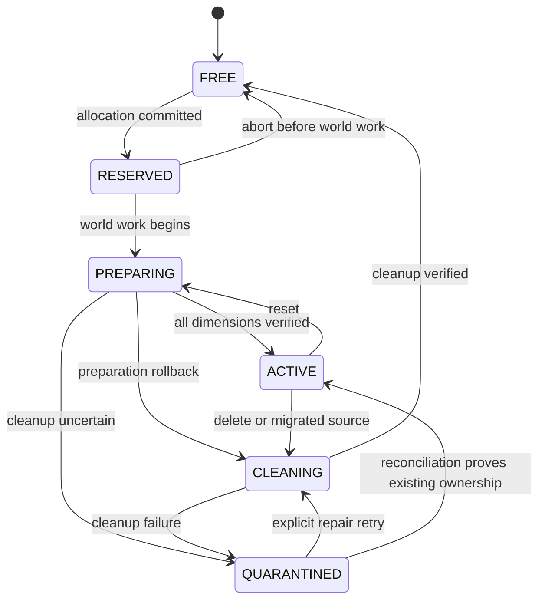

# Grid, Slot, and Border Invariants

- Status: Accepted
- Specification version: 1

## Purpose

This specification defines shard groups, fixed cells, deterministic slot allocation, border geometry,
location lookup, and slot cleanup. It is independent of Bukkit location objects and SQL dialect APIs.

## Shard and dimension model

A shard group is identified by a namespaced `ShardGroupId` and contains zero or one world projection
for each configured dimension. Version 1 recognizes overworld, nether, and end dimension IDs while
allowing namespaced custom dimension IDs in the model.

One logical slot has one `GridPosition` shared by every dimension projection in its shard group. No
other island may use that grid position in any dimension of the group. Portal and teleport services
MUST resolve the destination through the island slot; they MUST NOT use vanilla coordinate scaling
that could select another island's cell.

## Grid configuration

For each shard group:

- `cellSize` MUST be a positive integer divisible by 16;
- `maximumBorder` and `initialBorder` MUST be positive integers;
- `initialBorder <= maximumBorder`;
- `safetyGap` MUST be non-negative;
- `cellSize - maximumBorder >= safetyGap`.

The default baseline is `cellSize=512`, `initialBorder=64`, `maximumBorder=384`, and
`safetyGap=128`. Config validation MUST reject invalid geometry before worlds or repositories start.

`GridPosition` uses signed integer `(gridX, gridZ)` values. Coordinate multiplication and offset
calculation MUST use signed 64-bit intermediates and reject centers or bounds outside the configured
Minecraft world limit before narrowing to block coordinates.

## Cell geometry

For an even `cellSize`:

```text
centerX = gridX * cellSize
centerZ = gridZ * cellSize
cellMinX = centerX - cellSize / 2
cellMinZ = centerZ - cellSize / 2
cellMaxXExclusive = cellMinX + cellSize
cellMaxZExclusive = cellMinZ + cellSize
```

All block bounds are half-open: minimum inclusive, maximum exclusive. Y is not part of cell ownership;
allowed build height is a separate shard policy constrained by the target world's min/max height.

With `cellSize=512`, grid `(0,0)` owns X/Z `[-256,256)`. Grid `(1,0)` owns `[256,768)`.
No block belongs to two cells.

## Location lookup

Given a block coordinate and an even cell size:

```text
gridX = floorDiv((long) blockX + cellSize / 2, cellSize)
gridZ = floorDiv((long) blockZ + cellSize / 2, cellSize)
```

The implementation MUST use floor division, not Java's truncating `/` operator. Lookup proceeds:

1. Resolve world UUID to immutable shard-group and dimension metadata.
2. Compute the grid position arithmetically.
3. Lookup `(shardGroupId, gridX, gridZ)` in the locator index.
4. Return the island ID and slot state, or no island.

Event handlers MUST NOT query the database, load chunks, inspect block metadata, or scan islands for
location lookup.

The locator index contains minimal entries for every non-`FREE` slot. It does not keep island
aggregates or chunks loaded. Database state is authoritative; the index is rebuilt at startup and
updated only after the ownership transaction commits. Duplicate or contradictory entries cause the
affected cell to fail closed and emit diagnostics.

## Border geometry

A border is centered logically on the cell center and represented as integer block bounds:

```text
borderMinX = centerX - floor(borderSize / 2)
borderMinZ = centerZ - floor(borderSize / 2)
borderMaxXExclusive = borderMinX + borderSize
borderMaxZExclusive = borderMinZ + borderSize
```

This supports odd and even sizes without ambiguous block membership. A visualization or Paper world
border center is derived as `(min + maxExclusive) / 2.0`; it is half-block aligned for odd sizes.

The three island regions are:

- **current border**: gameplay and protection bounds;
- **reserved region**: bounds at `maximumBorder`, available to future upgrades;
- **full cell**: lookup and isolation bounds, including the safety gap.

Protection MUST test source and destination block centers against current border bounds. Structures
declare whether they are restricted to the current border or reserved region; no structure may leave
the full cell. The actual gap between adjacent maximum borders is `cellSize - maximumBorder`.

## Slot identity and spiral order

`SlotId` is a UUID v4 independent of its ordinal and coordinates. A slot stores a non-negative signed
64-bit `ordinal`, shard group, grid position, state, owning island reference, and state version.

Ordinal-to-grid mapping is a deterministic counter-clockwise square spiral beginning east:

```text
0: ( 0, 0)
1: ( 1, 0)
2: ( 1, 1)
3: ( 0, 1)
4: (-1, 1)
5: (-1, 0)
6: (-1,-1)
7: ( 0,-1)
8: ( 1,-1)
9: ( 2,-1)
```

The mapping MUST be a pure bijection with an inverse used by diagnostics. It MUST fail on arithmetic
overflow or configured world-limit overflow rather than wrap. Shard groups maintain independent
ordinal sequences.

## Allocation transaction

Allocation prefers the lowest-ordinal reusable slot, keeping active space compact:

1. Begin a write transaction.
2. Lock/select the lowest `FREE` slot for the shard group.
3. If found, conditionally update it to `RESERVED`, assign the island and increment slot version.
4. Otherwise lock the shard allocator row, read and increment `nextOrdinal`, derive the grid position,
   and insert a `RESERVED` slot.
5. Insert/update the island allocation operation in the same transaction.
6. Commit, then publish the locator-index change.

The database MUST enforce uniqueness for `(shard_group_id, grid_x, grid_z)`, `slot_id`, and active
ownership. A uniqueness or expected-state conflict aborts the transaction and is retried as a new
allocation attempt; Java locks are not authoritative.

SQLite uses WAL mode and `BEGIN IMMEDIATE` so write contention is discovered before allocation reads.
`SQLITE_BUSY` uses bounded jittered backoff and never falls back to an unsafe read-then-write path.
MySQL/MariaDB uses indexed `SELECT ... FOR UPDATE` on the selected slot or allocator row. Allocation
does not use `SKIP LOCKED` because a skipped lowest slot would make backend behavior inconsistent and
allocation frequency does not justify queue-style semantics.

## Slot lifecycle



`QUARANTINED` MUST NOT transition directly to `FREE`. Reconciliation may restore `ACTIVE` only when
database ownership, island state, and all dimension projections prove the same existing island owns
the slot. Otherwise an explicit cleanup pass is required.

## Cleanup verification

Cleanup operates across every dimension projection and keeps required chunks active only for the
operation. Before `FREE`, it MUST verify:

- configured cell/reserved blocks were cleared according to cleanup policy;
- plugin-created entities and block entities were removed;
- structure, regeneration, and delayed world work completed or was cancelled;
- chunk and plugin tickets were released;
- locator state no longer exposes an owner;
- no island, migration target, pending operation, or scheduled action references the slot.

Chunk unload alone is not cleanup evidence. A timeout or unverifiable effect moves the slot to
`QUARANTINED` and leaves enough operation data for inspection.

## Acceptance vectors

Implementations must cover at least:

1. Boundary lookup at `-257`, `-256`, `255`, `256`, and equivalent Z coordinates for size 512.
2. Random coordinate round trips from grid to cell and back, including negative grid positions.
3. Odd and even border sizes produce exactly the requested number of block coordinates.
4. Current and reserved borders never overlap a neighboring reserved border under valid config.
5. The first several complete spiral rings are unique and invertible.
6. Overflow and world-limit inputs fail without allocating a slot.
7. Concurrent allocations cannot return the same slot or grid position.
8. A failed transaction does not update the locator index.
9. A location in the same logical slot resolves the same island in every enabled dimension.
10. Cleanup failure leaves the slot quarantined and unavailable to allocation.

## References

- [Java 21 `Math.floorDiv`](https://docs.oracle.com/en/java/javase/21/docs/api/java.base/java/lang/Math.html)
- [SQLite transactions](https://www.sqlite.org/lang_transaction.html)
- [SQLite write-ahead logging](https://www.sqlite.org/wal.html)
- [SQLite table constraints](https://www.sqlite.org/lang_createtable.html)
- [MySQL locking reads](https://dev.mysql.com/doc/refman/8.4/en/innodb-locking-reads.html)
