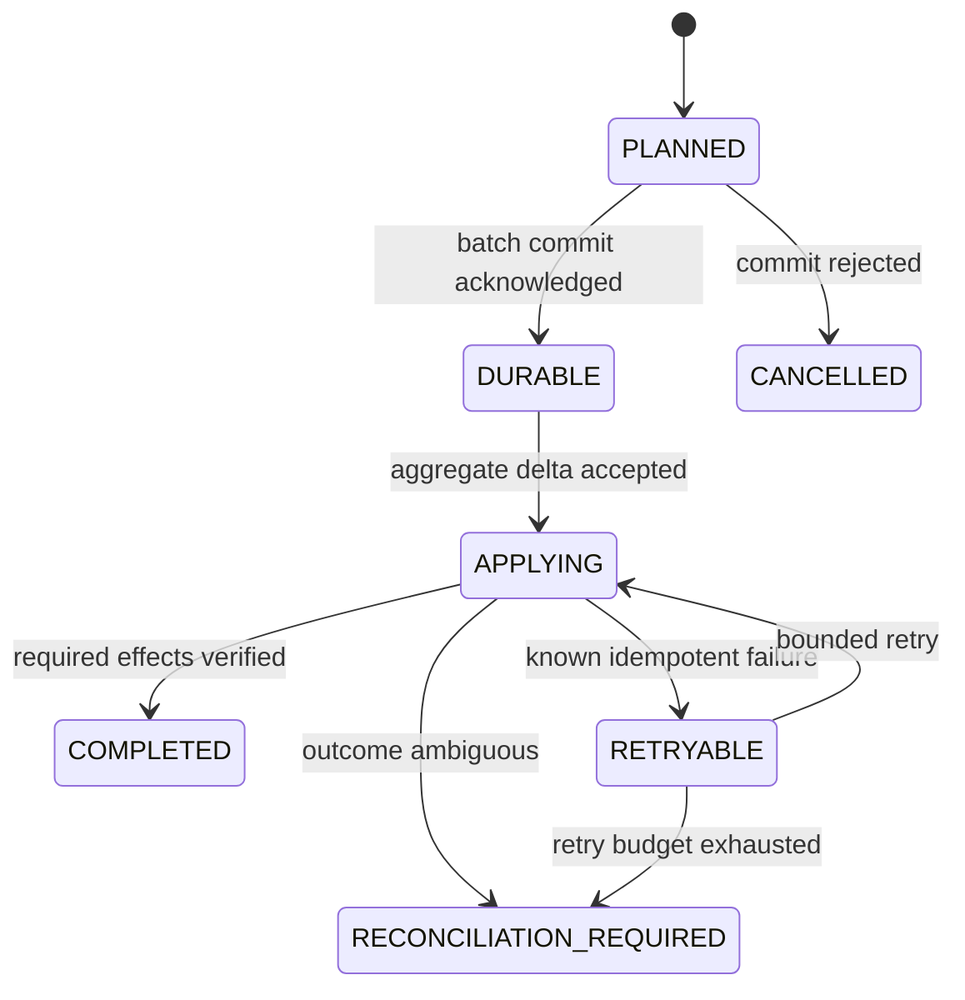
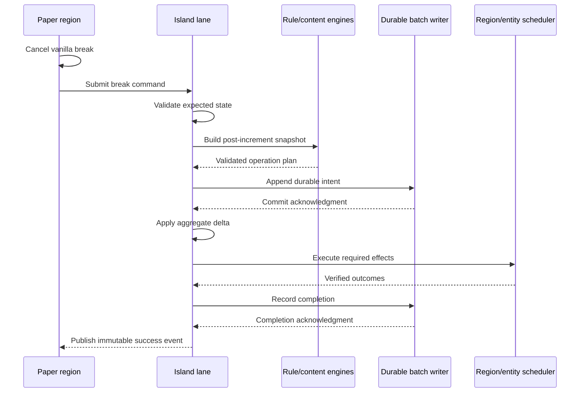

# Magic Block Transaction Pipeline

- Status: Accepted
- Specification version: 1

## Purpose

This specification defines how a valid Magic Block break becomes one recoverable logical operation.
It covers sequencing, snapshots, durable intent, effect ordering, idempotency, backpressure, crash
recovery, and public event timing.

## Magic Block state

An island may own multiple Magic Blocks. Each is addressed by a namespaced ID unique within the
island and stores its location, content profile, current content descriptor, state, non-negative
sequence, cooldown, lock state, and content fingerprint.

The sequence identifies accepted break operations, not raw Paper events. It MUST only advance after
the operation intent becomes durable. The database enforces uniqueness on
`(island_id, magic_block_id, sequence)`.

The content fingerprint identifies the state a break event observed. For vanilla blocks it includes
the expected sequence and normalized block data. Custom providers add their stable content identity.
The fingerprint MUST NOT depend on object identity or provider implementation classes.

## Event capture and duplicate rejection

The Paper adapter MUST cancel vanilla block breaking before dispatch. It captures an immutable break
command containing actor, island ID, Magic Block ID, observed sequence, content fingerprint, cause,
and event time, then submits it to the island lane.

The command is rejected without consuming a sequence when:

- the island or Magic Block no longer exists;
- the island is not `ACTIVE`;
- protection denies the actor or cause;
- the block location/profile is not the registered Magic Block;
- observed sequence or fingerprint differs from current state;
- cooldown or explicit Magic Block lock is active.

Two Paper events may observe the same sequence before the first finishes. Lane serialization lets
the first accepted operation advance it; the second then fails its expected-sequence check. It MUST
NOT increment counters, evaluate rules, or emit rewards.

## Proposed mutation and event snapshot

Evaluation works on a proposed delta rather than mutating the aggregate early:

1. Propose `nextSequence = currentSequence + 1`, failing before overflow.
2. Propose system counter increments and record each `before`, `after`, and `delta`.
3. Build one immutable event snapshot from current aggregate state plus the proposed delta.
4. Capture the immutable rule registry version.
5. Evaluate indexed rules and the phase content selector against that snapshot.
6. Produce one operation plan and validate conflicts, limits, target bounds, and capabilities.

Every rule evaluated for the event sees the same post-increment snapshot. Conditions cannot observe
actions from another rule in the same event. The mutable aggregate is unchanged if evaluation or
planning fails.

## Durable operation intent

An accepted plan receives an `OperationId`. Its durable intent contains at least:

- island, Magic Block, actor, registry version, and sequence identifiers;
- expected aggregate and Magic Block versions;
- counter/state delta and execution-policy reservations;
- selected next content and normalized effect descriptors;
- an ordered effect list with per-effect idempotency keys;
- timestamps, retry classification, and current operation state.

Intent writes use one global bounded batch writer rather than one writer or repeating task per island.
The batch transaction inserts operation intents and critical `once`/cooldown reservations. A lane
waits asynchronously for the database commit acknowledgment; it does not block the Paper region
thread.

Database failure, queue saturation, shutdown rejection, or acknowledgment timeout MUST fail closed:
the vanilla break remains cancelled, the proposed delta is discarded, and no world or reward effect
runs. Backpressure may notify the player, but notifications are rate-limited and best effort.

Normalized island/counter tables may be projected with write-behind because the durable operation
contains the authoritative unprojected delta. Startup replays committed operations before gameplay.

## Operation and effect states

After durable acknowledgment, the lane validates expected versions once more and applies the delta to
the loaded aggregate. A mismatch is `RECONCILIATION_REQUIRED`; it is never merged automatically.

Effects execute in this order:

1. Required idempotent world/content mutation.
2. Critical reward and external integration effects.
3. Best-effort messages, sounds, particles, and diagnostics.
4. Durable completion record and normalized projection enqueue.
5. Immutable public success event.

Required effect failure prevents `COMPLETED`. Best-effort effect failure is logged with operation
context but does not reverse a completed reward or world mutation.

## Idempotency

Each effect key is derived from `OperationId` and stable action index. Providers receive this key when
their contract supports idempotency.

Effects are classified during compilation/planning:

- **Naturally idempotent**: setting a block to a verified descriptor or storing an exact state value.
- **Detectably idempotent**: spawning a plugin-owned entity carrying the effect ID, when lookup can
  prove whether that entity already exists.
- **Provider idempotent**: an economy or custom-content provider guarantees key deduplication.
- **Non-idempotent**: commands, inventory grants, or providers that cannot prove prior execution.
- **Best effort**: messages and audiovisual feedback whose loss does not change authoritative state.

Inventory item tags do not prove idempotency after an item can be moved, consumed, or transformed.
Such delivery remains non-idempotent unless it goes through a provider-owned durable mailbox.

An idempotent effect may be retried only while its expected target and operation identity still match.
A crash between starting and recording a non-idempotent effect is ambiguous. Recovery MUST mark the
operation `RECONCILIATION_REQUIRED`, lock island gameplay, and expose evidence to admin tools; it
MUST NOT retry automatically.

## World mutation rules

World effects MUST be scheduled by target location; entity effects MUST use the entity scheduler.
The island lane never assumes completion because a task was submitted. It resumes only from an
explicit success/failure result.

Before mutation, the executor revalidates shard, dimension, slot ownership, current border/reserved
policy, target fingerprint, and island operation identity. A changed target is an invariant conflict,
not permission to overwrite unknown state.

Multi-region effects are decomposed into bounded region-owned steps coordinated by the operation.
They MUST NOT share mutable aggregate state. Partial completion remains recoverable from effect IDs
and recorded progress.

## Completion and public events

`COMPLETED` is recorded only when every required effect has a verified outcome. The completion record
includes final aggregate version, Magic Block sequence, effect summaries, and projection status.

Public `MagicBlockProcessed`-style events are post-commit observations. They carry immutable before/
after views and operation identifiers, are not cancellable, and cannot mutate the aggregate directly.
Failure and reconciliation events are separately typed and do not masquerade as success.

## Restart and shutdown recovery

Startup completes durable replay before accepting gameplay:

1. Project unapplied durable state deltas in sequence order per island.
2. Inspect `APPLYING` and `RETRYABLE` effects through their idempotency strategy.
3. Resume only effects whose non-execution or idempotent outcome can be proven.
4. Mark ambiguous operations and their islands for reconciliation.
5. Rebuild runtime Magic Block sequences and locator state from authoritative projections.

Shutdown stops new break acceptance, drains already submitted intent batches for a bounded period,
records unresolved durable operations, releases chunk tickets, and leaves remaining work recoverable.
It MUST NOT mark unfinished operations complete merely to finish shutdown.

## Sequence flow

## Acceptance vectors

Implementations must inject failures at least at these boundaries:

1. Duplicate events with the same observed sequence produce one durable operation.
2. Planning failure consumes no sequence and performs no effect.
3. Database unavailability or a full batch queue leaves the Magic Block unchanged.
4. Crash before intent commit permits a fresh attempt with the same next sequence.
5. Crash after intent commit but before aggregate apply replays the delta once.
6. Crash before an idempotent block mutation safely retries after target verification.
7. Crash during a non-idempotent reward locks the island for reconciliation without auto-redelivery.
8. Completion is not published before durable completion acknowledgment.
9. Two different Magic Blocks on one island remain serialized by the same island lane.
10. A world target outside the allowed region aborts before any effect.
11. Rule `once` reservation and operation intent either both commit or neither commits.
12. Restart replays multiple durable sequences in order and reconstructs the final snapshot.

## References

- [Supporting Paper and Folia](https://docs.papermc.io/paper/dev/folia-support/)
- [Folia region ownership overview](https://docs.papermc.io/folia/reference/overview/)
